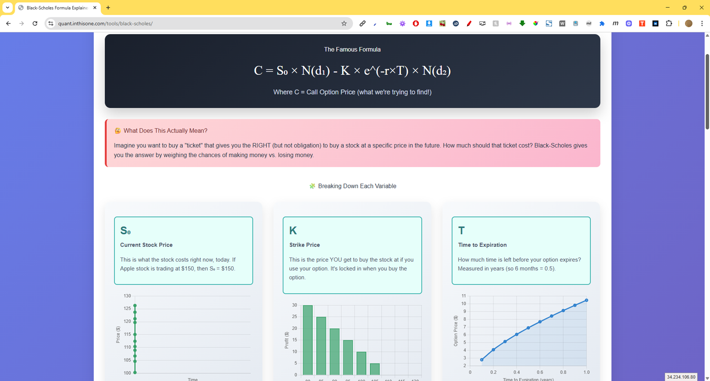

# 🧠 Black-Scholes Option Pricing Calculator

A simple web-based tool to calculate the theoretical price of European call and put options using the **Black-Scholes model**.

## 📈 Overview

This calculator allows users to input key parameters:
- **Stock Price (S)**
- **Strike Price (K)**
- **Time to Expiration (T)** – in years
- **Volatility (σ)** – as a decimal (e.g., 0.2 for 20%)
- **Risk-Free Rate (r)** – as a decimal
- **Option Type** – Call or Put

It returns the theoretical price based on the Black-Scholes formula.

> This project was built using **AI-assisted development** to rapidly prototype and iterate on the model, following a first-principles learning approach.

## 🧮 Formula

The calculator uses the standard Black-Scholes formulas:

\[
C = S N(d_1) - K e^{-rT} N(d_2)
\]
\[
P = K e^{-rT} N(-d_2) - S N(-d_1)
\]

Where:

\[
d_1 = \frac{\ln(S/K) + (r + \sigma^2 / 2)T}{\sigma \sqrt{T}}, \quad d_2 = d_1 - \sigma \sqrt{T}
\]

## 🚀 Live Demo

👉 [Try it live here](https://quant.inthisone.com/tools/black-scholes/)

## 🛠 Tech Stack

- HTML/CSS/JavaScript
- No external libraries
- AI-assisted code generation + manual refinement

## 📂 File Structure 